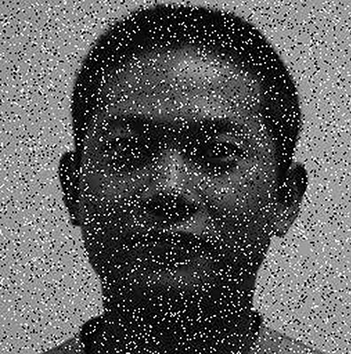
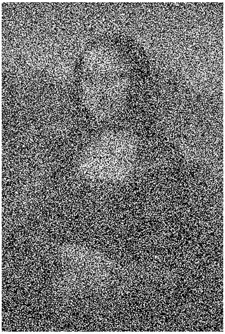
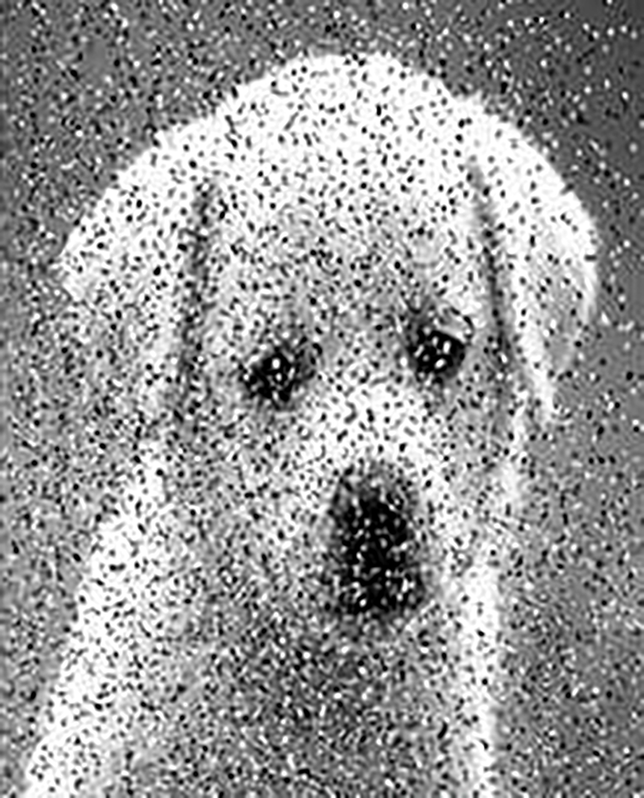
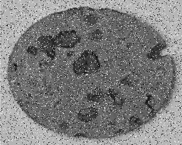
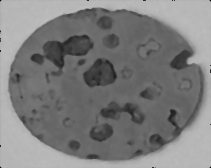

# Parallel-Median-filter
 Image noise reduction using median filter with dynamic filter window size to control it, The filter is built using C++ with MPI to run in parallel and to show the perforamnce measures between it and the sequential version

